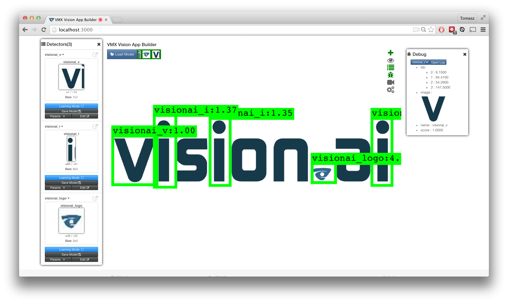
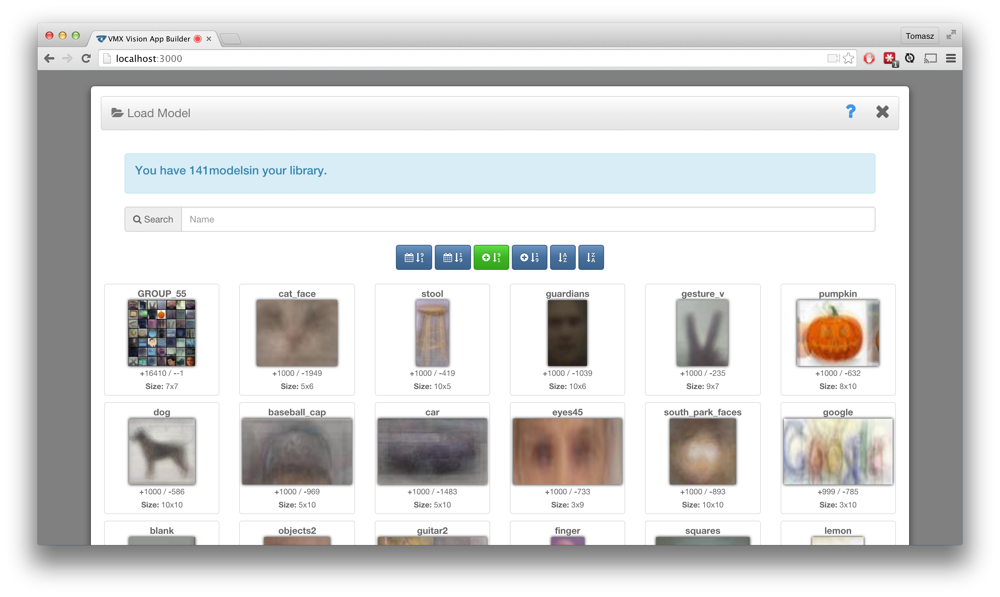
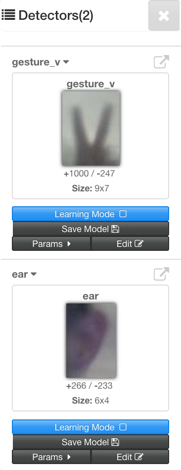
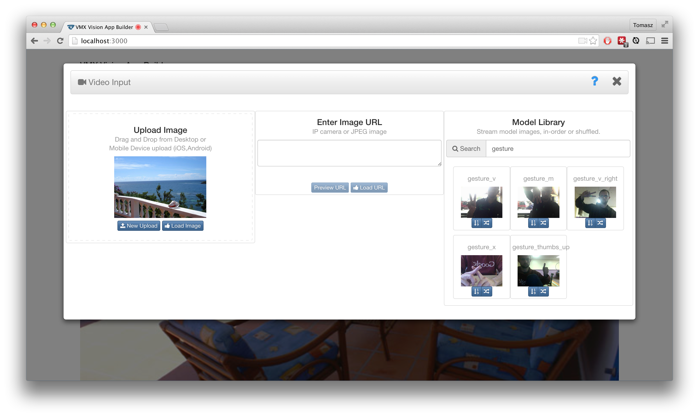
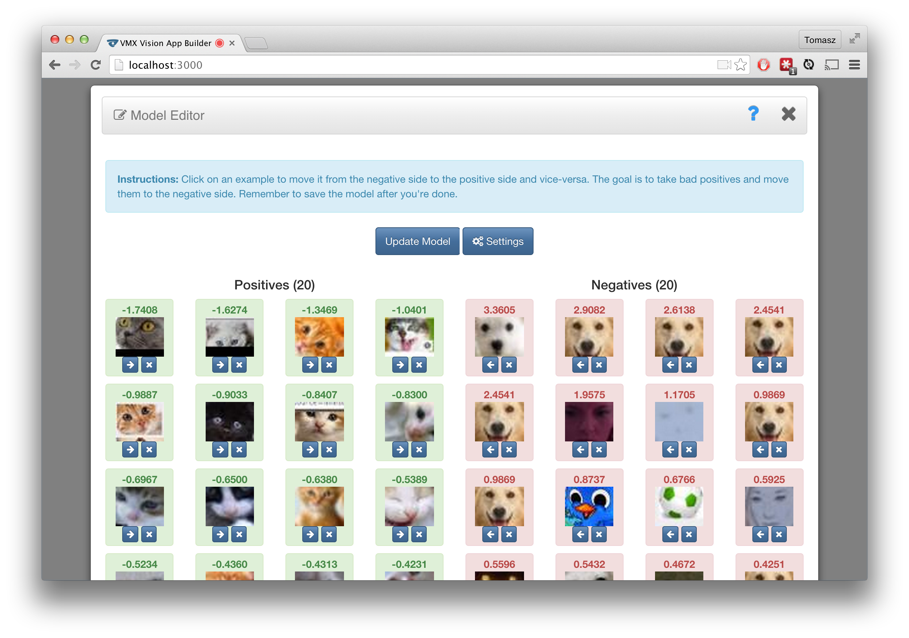

# Learn VMX

VMX's powerful GUI, called the "VMX Vision App Builder" is a web-based
GUI for interacting with your object detectors.  Inside the VMX Vision
App Builder, you can set a variety of different input streams (webcam,
IPcam, ...), interactively train new models in as little as 1 minute,
modify and customize existing models, as well as interact with running
sessions.

---

## Loading Models

To load a model, just click the "Load Model" button at the top-left of
the VMX App Builder.  You will be shown a listing of all of your
models and you can sort them by name, date, or number of positive
examples. A new session will be created with the model you click.

If you do not have any models to load, consider learning how to create
models in the [Creating Models](VMXAppBuilder.md#creating-models) sections of this page.

---

## Creating Models
<i class="fa fa-2x fa-eye fa-fw"></i>

To create a model, click on the <i class="fa fa-eye"></i> icon inside VMX App Builder.

<iframe width="210" height="158"
src="//www.youtube.com/embed/gobBjO8zLdw" frameborder="0"
allowfullscreen></iframe>

<iframe width="210" height="158" src="//www.youtube.com/embed/lQahegSw-Ug" frameborder="0" allowfullscreen></iframe>

<iframe width="210" height="158"
src="//www.youtube.com/embed/19j62PrQdio" frameborder="0"
allowfullscreen></iframe>

The "Create Model" pane will let you select objects from the main VMX
canvas. Simply draw a rectangle around your object of interest.  While
VMX will often work from a single positive example, it is
***beneficial to start with 3-5 initial examples***.  To help VMX
bootstrap a good model, move the object of interest between successive
selections.

**NOTE:** The second time you create a model, your old selections will
  still be in the queue.  Simple remove them if you are training a new
  object.

After you have created an initial model, time to make it better by
using the automatic learning mode.

---

## Multiple detectors

VMX App Builder has a built-in VMX session manager, so you can work
with multiple models at the same time.  Each VMX session corresponds
to a separate VMX process.  A single model inside a session will
typically occupy around 150 MB (closer to 500MB during training), so
you shouldn't try to open up too many VMX sessions at the same time.

After you load or create a model, VMX will list the names of available
sessions right below the "Load Model" button.  When you start VMX App
Builder, all sessions are in the "detached" state.  Clicking one of
the model names will place it in the "attached" state.

#### List Detectors Button

<!---->

<i class="fa fa-2x fa-list fa-fw"></i>

#### Detach Detector Button

<i class="fa fa-2x fa-external-link fa-fw"></i>

---

## Video Input

<i class="fa fa-2x fa-video-camera fa-fw"></i>

You can select the video input modal by clicking the <i class="fa
fa-video-camera"></i> button or it is automatically loaded when a
webcam cannot be found.  If you do not have a physical webcam, you can
use one of the many popular free virtual camera programs (like
[CamTwist](http://camtwiststudio.com/) on the Mac).  A virtual camera will additionally let you
stream video from your desktop and application windows directly into VMX.

To set the external source to be other than the webcam, simply load
the VMX App Builder and hit **Deny** when VMX asks to use your webcam.

When choosing an external source, you have several options:

#### Single Image Upload

This will let you upload an image directly from your computer, tablet,
or smartphone.  (This feature is currently **experimental** on iOS.)

#### Load from a custom URL

A custom URL allows you to use just about any IPcam.  Any URL which
returns an image can be used as an image stream.  After the URL has
been entered, use the "Preview URL" button to preview the stream.

#### Load from models/#model_uuid/stream

You can also randomly cycle through all model images inside a specific
model folder.

#### Load from /random

This will randomly cycle through all model images inside VMX.

---

## Model Parameters

To customize a model, you can change its internal parameters.  With
these knobs, you can adjust speed and performance -- we provide many
different parameters which you are free to play with.  First load a
model, and then click on the "parameters" button.

#### Cell Size
Cell size is the feature analysis window size (in pixels).  Try
setting cell size to 4pixels for detecting small object instances.

#### Left-Right Image Flip
Enabling this option will apply the detector on the original image as
well as the left-right flip.  The flip is done on the backend, so only
one image is sent to the server.  Enabling this option helps for
objects with horizontal symmetry (e.g., left-hand and right-hand).

#### Maximum Overlap Threshold
This determines which "redundant" bounding boxes to keep after
applying the detector.  In the computer vision literature, this is
commonly known as non-maximum suppression.

A large overlap threshold (e.g., 0.8) will keep many redundant
detection boxes around the true positive and a very small overlap
threshold (e.g., 0.0), will never return overlapping detections.

#### Detection Display Threshold
This number controls which detection windows to display.  This knob
defaults at -1.0, but a properly-trained model will show nicer detection
with a score of 0.0.  A smaller number will show more detections.

#### # of Learning Iterations
The number of learning updates performed at each iteration of
learning.  A larger number will make learning slower, but more work
will be spent on learning between iterations.

#### # of Learning Positives
During Learning Mode, this specified the maximum number of positives
to expect in an image.  The most common setting is 1, but setting this
to 0, will put the detector in negative learning mode, where every
image is treated as a negative.

#### Learning Update Threshold
The threshold which determines if a candidate window should be
considered a positive.  The default of 0.0 is too high for certain
difficult objects, or objects not initialized with enough data.  If
you are having an issue getting Learning Mode to pick up new examples,
consider setting this threshold to -1, acquiring new examples, then
setting it back to 0.0.  Keeping this threshold at -1 for a long time
will likely make the detector absorb negatives into the positive set.

#### Detector Quality

The quality of the detector determines the number of candidate windows
evaluated.  A detector quality of 1 will produce at most a single
detector, while a detector quality of 3000 will produce many
detection all over the input image.  If you want fast detection,
consider setting the detector quality to 1.0.  If you want to absorb
more negatives during learning, consider setting this to the maximum
value of 3000.

---

## Debugging Detectors

You can watch the top scoring detection image from each session by
clicking on the "bug" icon.

<i class="fa fa-4x fa-bug fa-fw"></i>

---

## Learning Mode

To improve a model, it can automatically go into "learning mode."
While in Learning Mode, VMX will automatically figure out which new
examples belong to the object of interest.  When learning, the model
will become larger as well as become more powerful.

If you are having an issue getting Learning Mode to assimilate new
positive examples, consider momentarily setting the "Learning Update
Threshold" to something smaller like -1.

---

## Editing Models

Click on the "Edit Model" button to see a visualization of the
positives and negatives inside the model.  You are free to move the
positives to the negative side, and vice-versa.  In very difficult
training scenarios, you will have to use this Model Editor to clean up
any mistakes made by the automatic learning algorithm.

---

## Tracker Settings

<i class="fa fa-2x fa-gears fa-fw"></i>

---

## URL Parameters

You can change certain VMX App Builder settings by passing in URL
parameters.  The default is URL is `http://localhost:3000` but you can
make it more complex by adding a `#?` for the first field and adding
other fields with a `&` delimiter.

#### Changing width/height
Height and width are integers.  Defaults to 320x240, but you can
make it 640x480 or 160x120.

`http://localhost:3000/#/?width=640&height=480`

#### Auto-attaching to all sessions
This will automatically attach all VMX sessions which have a loaded
model.  Very cool for making a demo which automatically runs all of
your detectors.

`http://localhost:3000/#/?auto_attach=true`

#### Turning on the tracking grid display

`http://localhost:3000/#/?show_grid=true`

#### Making grid wiggle without detections

`http://localhost:3000/#/?grid_always=true`

#### Not rendering the video input

`http://localhost:3000/#/?hide_video=true`

#### Showing raw detection boxes (without tracking)

`http://localhost:3000/#/?show_raw_boxes=true`

#### Passing in IP camera URL

This will poll the provided `url` every `ipcam_delay` seconds after
the last successful request.  Can be used with an IP camera to stream
images to VMX or from using a command line utility which streams
locally hosted movies as an IP camera.

`http://localhost:3000/#/?url=http://localhost:8081`

#### Setting the ipcam_delay

The delay after the last successful request. To be used in conjunction
with `url`.

To get images very quickly (20ms delay):

`http://localhost:3000/#/?url=http://localhost:8081&ipcam_delay=20`

To get images slowly (2000ms delay):

`http://localhost:3000/#/?url=http://localhost:8081&ipcam_delay=2000`

#### Turning off mirror_mode (enabled by default)

This will give the original image so that text is oriented left-right
for people to read.  Note that the default mode of operation is mirror
mode so that you can interact with your detectors more naturally.

`http://localhost:3000/#/?mirror_mode=false`
