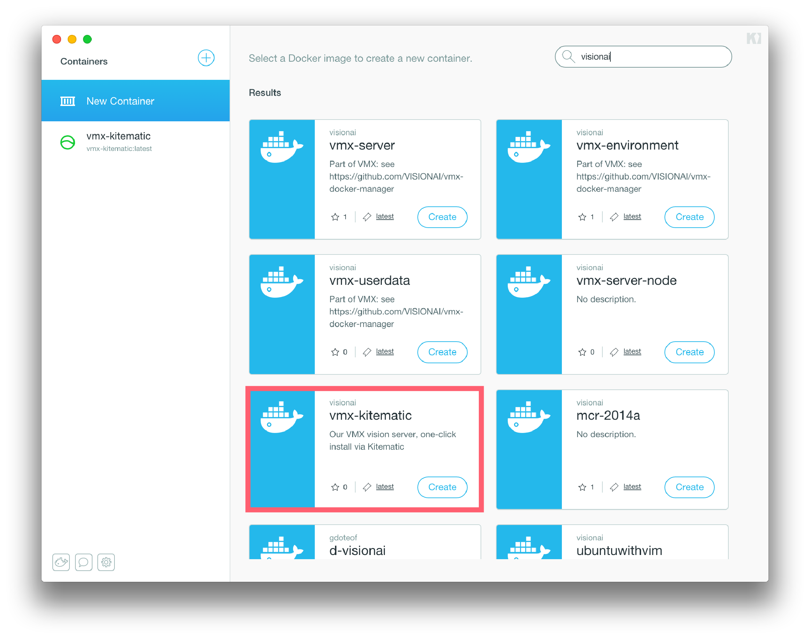

# Install

Instructions for installing, updating, and activating vision.ai's
flagship VMX Vision Server.

---


## Linux

On Linux, VMX uses Docker and we serve pre-built and tested images on
Docker Hub. When using VMX via Docker, all dependencies are downloaded
behind-the-scenes and the installation procedure takes 3 easy steps.


For information on installing Docker please see
[Docker Documentation](https://docs.docker.com/installation/#installation).

**To check that Docker is installed and running**:

```
docker ps
```

Next, download or checkout vision.ai's <a
href="https://github.com/VISIONAI/vmx-docker-manager">vmx-docker
manager</a>, a small utility for starting, stopping, and updating VMX.

**To start VMX on port 3000, run:**

```
git clone https://github.com/VISIONAI/vmx-docker-manager.git
cd vmx-docker-manager
./vmx start 3000
```

You should now be able to access VMX at `http://localhost:3000`.

**To update VMX to use the stable version, run:**

```
./vmx update latest
./vmx start 3000
```

**And to update VMX to use the bleeding-edge dev release, run:**

```
./vmx update dev
./vmx start 3000
```

**You can see the visionai Docker Images you have installed by running:**
```
docker images | grep visionai
```

**Example Output**
```
visionai/vmx-server        dev                 590baf19662b        7 hours ago         176.6 MB
visionai/vmx-middle        dev                 c6f9dc07bbb6        13 hours ago        28.96 MB
visionai/vmx-middle        latest              f9955e4baa47        14 hours ago        28.96 MB
visionai/vmx-appbuilder    latest              36473619a9c4        15 hours ago        10.05 MB
visionai/vmx-appbuilder    dev                 7bdce3cb0a34        15 hours ago        10.05 MB
visionai/vmx-server        latest              b32769ac95b0        20 hours ago        176.7 MB
visionai/vmx-environment   latest              4269fc0c6d45        43 hours ago        219.2 MB
visionai/vmx-userdata      latest              e839f31f3037        8 months ago        2.433 MB
visionai/mcr-2014a         latest              163bc5ff564c        9 months ago        2.336 GB
```

**To stop VMX, save your sessions, then run:**

```
./vmx stop
```

---

## Mac OS X

You can download a native VMX installer for Mac OS X. The installer
contains the required VMX components and pretrained files. VMX for Mac
has been tested on OS X 10.9 Mavericks and OS X 10.10 Yosemite. It is
blazing fast on a modern Macbook Pro, yet runs decent on an old 1.4Ghz
Macbook Air.


<br/>
Stable: <a href="https://files.vision.ai/releases/VMX.pkg">
https://files.vision.ai/releases/VMX.pkg
</a>
<br/>
Stable: <a href="https://files.vision.ai/vmx/MacInstaller/MacInstaller.stable.pkg">https://files.vision.ai/vmx/MacInstaller/MacInstaller.stable.pkg</a>
<br/>
Latest: <a href="https://files.vision.ai/vmx/MacInstaller/MacInstaller.latest.pkg">https://files.vision.ai/vmx/MacInstaller/MacInstaller.latest.pkg</a>


Download the package, and click to install. The VMX Mac Installer
will guide you through a few screen and install all of the required
files into your `/Applications/VMX.app` folder.<br/> 

**Dependencies**

VMX requires v8.3 of the Matlab Compiler Runtime (MCR) R2014a -- a
separate 1.6GB download from the Mathworks, Inc website.  The MCR is
free of charge and is necessary to run VMX. The VMX Mac
Installer will send you to the MCR download page if it cannot find it on
your machine.  
<br/>

<a
href="http://www.mathworks.com/supportfiles/downloads/R2014a/deployment_files/R2014a/installers/maci64/MCR_R2014a_maci64_installer.zip"></a>

<a
href="http://www.mathworks.com/supportfiles/downloads/R2014a/deployment_files/R2014a/installers/maci64/MCR_R2014a_maci64_installer.zip">MCR_R2014a_maci64_installer.zip</a>

**Mac OS X notes**

Default MCR `/Applications/MATLAB/MATLAB_Compiler_Runtime/v83`

Default Path `/Applications/VMX.app/`

VMX Location `/Applications/VMX.app/Contents/MacOS/VMX`

VMXserver Location
`/Applications/VMX.app/Contents/MacOS/VMXserver.app/Contents/MacOS/VMXserver`

The default location for the MCR can be
changed via the MCR field of the VMX `config.json` configuration file.

The Mac OS X installer will use `/tmp/mcr_cache` as the MCR cache
directory.  If you're having issues with installation/activation, make
sure you have read/write permissions for this folder.  You can also
try removing the directory `/tmp/mcr_cache` in the case it gets corrupted.
VMXserver will regenerate a cache directory if it is not present.

**Uninstall**

To uninstall in Mac OS X, simply remove the `/Applications/VMX.app`
folder into your Trash.  VMX stores all of its files within this
directory, so be sure to back up your models if you have created any
of your own.

**Updating VMX**

If you want to update to the development version of VMX, you can run:
```
cd /Applications/VMX.app/Contents/MacOS/
./update.sh latest
```

If you want to update to the stable version of VMX, you can run:
```
cd /Applications/VMX.app/Contents/MacOS/
./update.sh latest
```

Alternatively, you can download the most recent Mac installer: it will
overwrite the old VMX binaries, automatically transfer over your existing
license/config files, and leave your models intact. To be safe, it is a good idea
to backup your `config.json` file which contains the key and license
information to run future versions of VMX on **your** computer.

Note, when running the VMX installer a second time, the installer will
save your old config files to `/tmp/vmx_installer.config.json` and
`/tmp/vmx_installer.settings.yml`.

**To stop VMX, save your sessions, then simply kill all VMX processes:**

```
pkill VMX
```

If you're worried about accidentally stopping other processes, you can
first run:
```
ps aux | grep VMX
```

---

## Windows

VMX has not been tested on Windows, but it should be possible to run
using some variant of boot2docker/kitematic.

### boot2docker (Mac / Windows?)

[boot2docker](http://boot2docker.io/) is a lightweight Linux
distribution made specifically to run Docker containers.  It runs
completely from RAM, weight ~27MB and boots in ~5s(YMMV).  This allows
you to run VMX on a Windows computer, as well as provide an
alternative method for installing on a Mac OS X system. VMX has been
tested on boot2docker running on Mac OS X 10.9.5


---


### Kitematic (Experimental Mac / Windows?)

[Kitematic](https://kitematic.com/) is a GUI for installing VMX containers. Search for
our single container VMX installer `vmx-kitematic` to try VMX. VMX has
been tested on Mac OS X 10.9.5



Checkout our blog post
[Dockerized Computer Vision for Mac via Kitematic](http://blog.vision.ai/vmx/2015/03/16/dockerized-computer-vision-for-mac-via-kitematic/)
for more details.

---

### Custom Build (Experimental)

If you need to download any of the individual VMX components, download
an older version, want to try a bleeding-edge experimental build, or
want to match your download against our MD5 checksums, please visit
[https://files.vision.ai](https://files.vision.ai).

---


## Activating VMX

Each VMX installation requires a valid key and an
internet connection to obtain a valid license from the vision.ai
activation server.  Activation is per-machine, and a new key/license
is required for installation on a new machine.

A valid VMX beta key corresponding to a personal license can be
purchased from [https://beta.vision.ai/purchase](https://beta.vision.ai/purchase).
<!--Please see [vision.ai forums](https://forums.vision.ai) to learn how
to be a beta tester.-->


**VMX GUI Activation**

Activation is usually performed from within the VMX App Builder GUI, but can also be
done from the command line.  Simply start the VMX application and the
GUI will help you activate the software if the license check fails, or
if it is your first time using VMX.

<!--You can visit the
[vision.ai forums](https://forums.vision.ai) if you are having issues
with activation.-->


**Command line activation (Mac)**

```sh
cd /Applications/VMX.app/Contents/MacOS/VMXserver.app/Contents/MacOS/
./activate.sh key email
```

**Activating VMX using REST API (Mac and Linux)**

```
curl -X POST -d '{"email":"tom@company.com"}' http://localhost:3000/activate/cf7b560d-1abf-46fa-bad1-a8b077ccc52a
```
**Checking the activation (Mac)**

```sh
cd /Applications/VMX.app/Contents/MacOS/VMXserver.app/Contents/MacOS/
./VMXserver -check
```

**Checking the activation via REST API (Mac and Linux)**
You can check your current version, your machine's unique uuid, and
whether your install is licensed:

**Request**
```
curl http://localhost:3000/check
```

**Example Response**
```
{
  uuid: "935169C6-C4E8-4393-875B-D80B5A998615",
  licensed: true,
  version: [
    "VMXserver_Linux_v0.1.0",
    "VMXmiddle_Linux_v0.3.0",
    "vmxAppBuilder_v0.1.1"
  ]
}
```

---

## Configuring VMX

The VMX configuration file `config.json` is located in the same
directory as the VMXserver binary and contains settings which can be
set before VMX starts.

```javascript
{
  "user"          : "",
  "license"       : "",
  "MCR"           : "/Applications/MATLAB/MATLAB_Compiler_Runtime/v83/",
  "data"          : "/vmx/data",
  "pretrained"    : "3f61ce5c7642bc2f24f7286f600b3e6b",
  "log_images"    : false,
  "log_memory"    : false,
  "display_images": false,
  "allow_urls"    : false,
  "read_only"     : false
}
```
 
The *user* and *license* fields get automatically set during the
activation procedure.  The *MCR* field points to the location of the
MATLAB MCR. The *pretrained* field is the default pretrained file used
for model creation. To see all available pretrained files, please
visit
[https://files.vision.ai/vmx/pretrained/MD5SUMS.json](https://files.vision.ai/vmx/pretrained/MD5SUMS.json). As
of August 2015, there are two different pretrained files you can use
to create models.


**log_images**

If enabled, it will keep full dataURLs in the VMX sessions log, which
makes them quite big.  By default, all dataURLs are replaced with the
string `IMAGE` inside the logs.

**log_memory**

If enabled, memory usage will be logged in each line of each VMX
session log.

**display_images**

If enabled, VMX will display image detections on your
desktop. This is useful for debugging purposes, and has been tested
on Mac OS X 10.9.5. Currently not supported in Docker as the X Desktop
is not forwarded.

**allow_urls**

If enabled, it will allow `http://` and `https://` URLS to be
specified for images. (Used in both create_model and process_image API
calls). The model create API call will also look for the `pretrained`
file at `https://files.vision.ai/vmx/pretrained`, which will not work
when allow_urls is set to false. Lastly, the `load_model` API call
allows the loading of remote models instead of UUIDs -- this is
disabled when allow_urls is false. For production use, it is
recommended to turn to set this flag to false.

**read_only**

If enabled, will only allow read_only operations. `create_model`,
`edit_model`, and `save_model` requests will return an
error. `process_image` requests will have learning_mode disabled when
*read_only* is set to true. For production use, it is recommended to
set this flag to false.

### Specifying main VMX directory and VMXserver build path

Next to the main VMX executable, there is a `settings.yml` file which
can be used to change the default location of the VMX models/sessions
directory. This makes sense when using the native Mac OS X.

** settings.yml on Linux**

```
Default: &defaults
  host: "*4" # any IPv4 host
  port: 3000
  approot: "http://localhost:3000"
  copyright: Copyright vision.ai, LLC 2013-2015
  wwwdir: "/vmx/"
  vmxpath: "/vmx/build"
```

On Mac, the `wwwdir` is by default relative to contain all VMX
information inside a single directory.

```
wwwdir: "./assets/"
```

## Download/Upload Models

No VMX install is complete without some models.

At vision.ai, we pretrained a large number of models for common
objects like faces, hands, hand gestures, body parts, logos,
etc. While there are scenarios where you really should create your own
model from scratch, sometimes it is faster to download a pretrained
model and adapt it to your data using VMX's learning_mode.

VMX comes with a Model Manager script called `models`. On Mac OS X,
you can find it right next to the VMX executable.  On Linux, it is a
part of vision.ai's <a href="https://github.com/VISIONAI/vmx-docker-manager">vmx-docker-manager</a>

**To download all available pretrained files (Mac)**

```
cd /Applications/VMX.app/Contents/MacOS/VMXserver.app/Contents/MacOS/VMXserver
./download_pretrained.sh
```

**To download all models from https://models.vision.ai (Mac and Linux)**

```
cd ~/vmx-docker-manager/
VMX_REMOTE_URL=https://models.vision.ai ./models download -all
./models import
```

**To download the models x and y from https://models2.vision.ai (Mac and Linux)**

```
cd ~/vmx-docker-manager/
VMX_REMOTE_URL=https://models2.vision.ai ./models download x y
./models import
```

**To upload all models to https://myserver.vision.ai (Mac and Linux)**

You will need root permissions on myserver.vision.ai, and have
configured VMX to be running vmx-docker-manager installed in the
directory `/home/root/vmx-docker-manager/`.

```
cd ~/vmx-docker-manager/
VMX_REMOTE_URL=https://myserver.vision.ai VMX_UPLOAD_SSH=root@myserver.vision.ai ./models upload -all
```

## VMX Directory Structure

#### Models

In order to recognize something in an image, you need to first learn a
model.  A model is a collection of positive and negative examples used
to describe a visual concept.  Models can be used to detect objects in
images and videos, and one of VMX's key strength is the ability to let
you easily make your own models.  You can use pre-trained models,
interactively re-train existing models, or just train your own by
waving an object in front of your webcam.  VMX can go into "automatic
learning mode", so you can observe the algorithm get better as it is
detecting objects in real-time.  Each model has a human-readable name
(e.g., "dog" or "tom") as well as its own unique birth certificate (we
use a 32 alphanumeric character universally unique identifier, or
UUID, to identify models). Models are stored in a
vmx_dir/models/model_id folder on your hard drive.  Each model also
contains customizable parameters (e.g., "max_image_size",
"detector_quality") which can be modified in real-time to adjust the
speed and performance of the running detector.

Inside each model directory, there is a `model.json` file which
contains meta-data about the model such as its human-readable `name`
(e.g., 'face', 'Tom', or 'left_hand'), a `data_set.json` file which
contains the data set of images and object locations used to train the
model, a `image.jpg` image of the model, a `params.json` file
containing the customizable parameters associated with the model, and
a binary file `model.data` with the internal representation of the
model as used by VMX.

*NOTE*: As you train more and more models, you should backup your models
directory so that you do not lose any of your work.

#### Sessions

Many applications require multiple object detectors, so we've made it
easy to run multiple VMX processes.  Each VMX process can have
different models loaded in memory and can separately go into learning
mode.  A session directory is created for each running VMXserver
process.  Sessions are referred to by UUIDs, and local session
information is stored in a sessions/session_id folder on local disk.
Local session information consists of a file
`sessions/session_id/model.json` which stores the information about
the models loaded into the session `session_id`.  The session
directory is also where information gets logged, so a
`sessions/session_id/log.txt` file will contain API logs of the VMX
process.

*NOTE*: The more you use VMX, your /sessions/ folder will grow with
longs of old sessions. You should either backup your logs (if you are
debugging your application) or feel free to delete the entire sessions
directory once you've made sure no VMX processes are active.

*NOTE*: The best way to launch main VMX processes is via the REST API
 provided in the VMX package.

---

Here is a typical directory structure on a deployed system:

* /vmx/models
* /vmx/models/#model_uuid
* /vmx/models/#model_uuid/model.json
* /vmx/models/#model_uuid/model.data
* /vmx/models/#model_uuid/image.jpg
* /vmx/models/#model_uuid/data_set.json
* /vmx/models/#model_uuid/data_set
* /vmx/models/#model_uuid/data_set/000001.jpg
* /vmx/models/#model_uuid/data_set/000001.json
* /vmx/sessions
* /vmx/sessions/#session_id/
* /vmx/sessions/#session_id/model.json
* /vmx/sessions/#session_id/log.txt


If you have any questions or suggestions for improving the VMX
Documentation, please submit an issue on Github.


