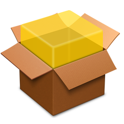
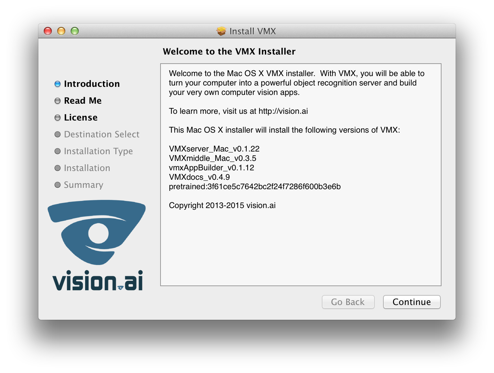

# Install

Instructions for installing, updating, and activating vision.ai's
flagship VMX Vision Server.

---


## Linux

On Linux, VMX uses Docker and we serve pre-built and tested images on
Docker Hub. When using VMX via Docker, all dependencies are downloaded
behind-the-scenes and the installation procedure takes 3 easy steps.


For information on installing Docker please see
[Docker Documentation](https://docs.docker.com/installation/#installation).

**To check that Docker is installed and running**:

```
docker ps
```

Next, download or checkout vision.ai's <a
href="https://github.com/VISIONAI/vmx-docker-manager">vmx-docker
manager</a>, a small utility for starting, stopping, and updating VMX.

**To start VMX on port 3000, run:**

```
git clone https://github.com/VISIONAI/vmx-docker-manager.git
cd vmx-docker-manager
./vmx start 3000
```

You should now be able to access VMX at `http://localhost:3000`.

**To update VMX to use the stable version, run:**

```
./vmx update latest
./vmx start 3000
```

**And to update VMX to use the bleeding-edge dev release, run:**

```
./vmx update dev
./vmx start 3000
```

**You can see the visionai Docker Images you have installed by running:**
```
docker images | grep visionai
```

**Example Output**
```
visionai/vmx-server        dev                 590baf19662b        7 hours ago         176.6 MB
visionai/vmx-middle        dev                 c6f9dc07bbb6        13 hours ago        28.96 MB
visionai/vmx-middle        latest              f9955e4baa47        14 hours ago        28.96 MB
visionai/vmx-appbuilder    latest              36473619a9c4        15 hours ago        10.05 MB
visionai/vmx-appbuilder    dev                 7bdce3cb0a34        15 hours ago        10.05 MB
visionai/vmx-server        latest              b32769ac95b0        20 hours ago        176.7 MB
visionai/vmx-environment   latest              4269fc0c6d45        43 hours ago        219.2 MB
visionai/vmx-userdata      latest              e839f31f3037        8 months ago        2.433 MB
visionai/mcr-2014a         latest              163bc5ff564c        9 months ago        2.336 GB
```

**To stop VMX, save your sessions, then run:**

```
./vmx stop
```

---

## Mac OS X

You can download a native VMX installer for Mac OS X. The installer
contains the required VMX components and pretrained files. VMX for Mac
has been tested on OS X 10.9 Mavericks and OS X 10.10 Yosemite. It is
blazing fast on a modern Macbook Pro, yet runs decent on an old 1.4Ghz
Macbook Air.


<br/>
Stable: <a href="https://files.vision.ai/releases/VMX.pkg">
https://files.vision.ai/releases/VMX.pkg
</a>
<br/>
Stable: <a href="https://files.vision.ai/vmx/MacInstaller/MacInstaller.stable.pkg">https://files.vision.ai/vmx/MacInstaller/MacInstaller.stable.pkg</a>
<br/>
Latest: <a href="https://files.vision.ai/vmx/MacInstaller/MacInstaller.latest.pkg">https://files.vision.ai/vmx/MacInstaller/MacInstaller.latest.pkg</a>


Download the package, and click to install. The VMX Mac Installer
will guide you through a few screen and install all of the required
files into your `/Applications/VMX.app` folder.<br/> 

**Dependencies**

VMX requires v8.3 of the Matlab Compiler Runtime (MCR) R2014a -- a
separate 1.6GB download from the Mathworks, Inc website.  The MCR is
free of charge and is necessary to run VMX. The VMX Mac
Installer will send you to the MCR download page if it cannot find it on
your machine.  
<br/>

<a
href="http://www.mathworks.com/supportfiles/downloads/R2014a/deployment_files/R2014a/installers/maci64/MCR_R2014a_maci64_installer.zip"></a>

<a
href="http://www.mathworks.com/supportfiles/downloads/R2014a/deployment_files/R2014a/installers/maci64/MCR_R2014a_maci64_installer.zip">MCR_R2014a_maci64_installer.zip</a>

**Mac OS X notes**

Default MCR `/Applications/MATLAB/MATLAB_Compiler_Runtime/v83`

Default Path `/Applications/VMX.app/`

VMX Location `/Applications/VMX.app/Contents/MacOS/VMX`

VMXserver Location
`/Applications/VMX.app/Contents/MacOS/VMXserver.app/Contents/MacOS/VMXserver`

The default location for the MCR can be
changed via the MCR field of the VMX `config.json` configuration file.

The Mac OS X installer will use `/tmp/mcr_cache` as the MCR cache
directory.  If you're having issues with installation/activation, make
sure you have read/write permissions for this folder.  You can also
try removing the directory `/tmp/mcr_cache` in the case it gets corrupted.
VMXserver will regenerate a cache directory if it is not present.

**Uninstall**

To uninstall in Mac OS X, simply remove the `/Applications/VMX.app`
folder into your Trash.  VMX stores all of its files within this
directory, so be sure to back up your models if you have created any
of your own.

**Updating VMX**

On Mac OS X, you can download the most recent installer: it will
overwrite the old VMX binaries, automatically transfer over your existing
license/config files, and leave your models intact. To be safe, it is a good idea
to backup your `config.json` file which contains the key and license
information to run future versions of VMX on **your** computer.

Note, when running the VMX installer a second time, the installer will
save your old config files to `/tmp/vmx_installer.config.json` and
`/tmp/vmx_installer.settings.yml`.

**To stop VMX, save your sessions, then simply kill all VMX processes:**

```
pkill VMX
```

If you're worried about accidentally stopping other processes, you can
first run:
```
ps aux | grep VMX
```

---

## Windows

VMX has not been tested on Windows, but it should be possible to run
using some variant of boot2docker/kitematic.

### boot2docker (Mac / Windows?)

[boot2docker](http://boot2docker.io/) is a lightweight Linux
distribution made specifically to run Docker containers.  It runs
completely from RAM, weight ~27MB and boots in ~5s(YMMV).  This allows
you to run VMX on a Windows computer, as well as provide an
alternative method for installing on a Mac OS X system. VMX has been
tested on boot2docker running on Mac OS X 10.9.5


---


### Kitematic (Experimental Mac / Windows?)

[Kitematic](https://kitematic.com/) is a GUI for installing VMX containers. Search for
our single container VMX installer `vmx-kitematic` to try VMX. VMX has
been tested on Mac OS X 10.9.5


Checkout our blog post
[Dockerized Computer Vision for Mac via Kitematic](http://blog.vision.ai/vmx/2015/03/16/dockerized-computer-vision-for-mac-via-kitematic/)
for more details.

---

### Custom Build (Experimental)

If you need to download any of the individual VMX components, download
an older version, want to try a bleeding-edge experimental build, or
want to match your download against our MD5 checksums, please visit
[https://files.vision.ai](https://files.vision.ai).

---


## Activating VMX

Each VMX installation requires a valid key and an
internet connection to obtain a valid license from the vision.ai
activation server.  Activation is per-machine, and a new key/license
is required for installation on a new machine.

A valid VMX beta key corresponding to a personal license can be
purchased from [https://beta.vision.ai/purchase](https://beta.vision.ai/purchase).
<!--Please see [vision.ai forums](https://forums.vision.ai) to learn how
to be a beta tester.-->


**VMX GUI Activation**

Activation is usually performed from within the VMX App Builder GUI, but can also be
done from the command line.  Simply start the VMX application and the
GUI will help you activate the software if the license check fails, or
if it is your first time using VMX.

<!--You can visit the
[vision.ai forums](https://forums.vision.ai) if you are having issues
with activation.-->


**Command line activation (Mac)**

```sh
cd /Applications/VMX.app/Contents/MacOS/VMXserver.app/Contents/MacOS/
./activate.sh key email
```

**Activating VMX using REST API (Mac and Linux)**

```
curl -X POST -d '{"email":"tom@company.com"}' http://localhost:3000/activate/cf7b560d-1abf-46fa-bad1-a8b077ccc52a
```
**Checking the activation (Mac)**

```sh
cd /Applications/VMX.app/Contents/MacOS/VMXserver.app/Contents/MacOS/
./VMXserver -check
```

**Checking the activation via REST API (Mac and Linux)**
You can check your current version, your machine's unique uuid, and
whether your install is licensed:

**Request**
```
curl http://localhost:3000/check
```

**Example Response**
```
{
  uuid: "935169C6-C4E8-4393-875B-D80B5A998615",
  licensed: true,
  version: [
    "VMXserver_Linux_v0.1.0",
    "VMXmiddle_Linux_v0.3.0",
    "vmxAppBuilder_v0.1.1"
  ]
}
```

---

## Configuring VMX

The VMX configuration file `config.json` is located in the same
directory as the VMXserver binary and contains settings which can be
set before VMX starts.

```javascript
{
  "user"          : "",
  "license"       : "",
  "MCR"           : "/Applications/MATLAB/MATLAB_Compiler_Runtime/v83/",
  "models"        : "/vmx/models/",
  "sessions"      : "/vmx/sessions/",
  "data"          : "/vmx/data",
  "pretrained"    : "3f61ce5c7642bc2f24f7286f600b3e6b",
  "log_images"    : false,
  "log_memory"    : false,
  "display_images": false
}
```


If enabled, *display_images* will display image detections on your
desktop.  This is useful for debugging purposes.  If enabled,
*log_memory* will log memory usage of VMX.  If enabled, *log_images*
will dump full dataURLs into the log, which makes them quite big, but
allows somebody from vision.ai to diagnose any issues you might be
having.  The *user* and *license* fields get automatically set during
the activation procedure. The *pretrained* field can be set to the
hash of any other file you would like to use for model creation, but
note that there are only a handful of distinct pretrained files ever
released by vision.ai.

There is also a VMX `settings.yml` file which can be used to change
the default location of the VMX models/sessions directory.

** settings.yml on Linux**
```
Default: &defaults
  host: "*4" # any IPv4 host
  port: 3000
  approot: "http://localhost:3000"
  copyright: Copyright vision.ai, LLC 2013-2015
  wwwdir: "/vmx/"
  vmxpath: "/vmx/build"
```

On Mac, the `wwwdir` is relative:
```
wwwdir: "./assets/"
```

If you have any questions or suggestions for improving the VMX
Documentation, please submit an issue on Github.

