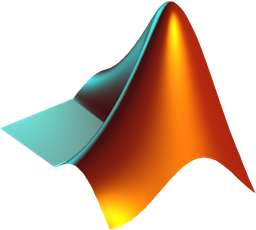

# VMX Documentation

Welcome to the VMX Documentation pages.  VMX is a web-based object
recognition server made by vision.ai.

---

# About VMX

The VMX Object Detection Engine comes with a highly-optimized visual
object detection algorithm engineered for speed, accuracy, and
ease-of-use.  VMX lets you quickly train new object models as well use
those models as object detectors for recognizing/localizing/tracking
objects in images and videos. The VMX Engine runs as a server and uses
a simple JSON-based command API so you can build apps in your favorite
programming language as well as interact with VMX over the HTTP
protocol.  For those of you that like cats, awks, and pipes, VMX can
also take commands from standard input (*command line support is
built-in*).  VMX is developed and maintained by
[vision.ai, LLC](http://vision.ai).

VMX runs on your personal computer, with native installers for Mac OS
X and Linux, as well as a Docker support which supports Windows, Mac
OS X, and Linux.  The VMX package consists of VMX Server, VMX Middle,
and the VMX App Builder.

This page focuses on installation and activation. To learn how to use
the VMX App Builder, see [VMX App Builder Docs](VMXAppBuilder.md). To
learn how to use the VMX REST API, see
[VMX REST API Docs](VMXmiddle.md). To learn about VMX server
internals, how models and sessions are organized on disk, and how to
use the VMX server directly, see [VMX Server Docs](VMXserver.md).


## Installing VMX

You can download a VMX installer for Mac OS X, or use a Docker image
when using Linux. VMX requires v8.3 of the Matlab Compiler Runtime
(MCR) R2014a, which is a separate 1.6GB download from the Mathworks
website.  When using Docker, all dependencies including the MATLAB MCR
will be automatically downloaded.

| | | |
|---|:----------:|:----------:|
|  | VMX Installer | MATLAB MCR|
|Mac OS X | <a href="https://files.vision.ai/releases/VMX.pkg"></a><br/><a href="https://files.vision.ai/releases/VMX.pkg">VMX.pkg</a> | <a href="http://www.mathworks.com/supportfiles/downloads/R2014a/deployment_files/R2014a/installers/maci64/MCR_R2014a_maci64_installer.zip"></a> <br/><a href="http://www.mathworks.com/supportfiles/downloads/R2014a/deployment_files/R2014a/installers/maci64/MCR_R2014a_maci64_installer.zip">MCR_mac.zip</a>|
| | | |
| | | |
| | | |
| | | |
|Linux | <a href="https://github.com/VISIONAI/vmx-docker-manager">vmx-docker-manager</a> | included in docker |
|Windows| boot2docker + <a href="https://github.com/VISIONAI/vmx-docker-manager">vmx-docker-manager</a> | included in docker |

##

If you need to download any of the individual VMX components, download
an older version, want to try a bleeding-edge experimental build, or
want to match your download against our MD5 checksums, please visit
[https://files.vision.ai/vmx](https://files.vision.ai/vmx).

### Linux

On linux we support a Docker installation.  With Docker installed, you simply need to download our <a href="https://github.com/VISIONAI/vmx-docker-manager">docker manager</a>.

For example, to start vmx on port 3000:

```
git clone https://github.com/VISIONAI/vmx-docker-manager.git

cd vmx-docker-manager

./vmx start 3000
```

When you run `./vmx init` (or `./vmx start PORT` for the first time),
a docker container with the binaries is started, which creates a
volume at `/vmx/build`

For information on installing docker please see the
[Docker Documentation](https://docs.docker.com/installation/#installation)

If you choose to use install VMX on a Linux machine without using
Docker, please refer to our Dockerfile to see the required packages
and libraries.

### boot2docker

[boot2docker](http://boot2docker.io/) is a lightweight Linux
distribution made specifically to run Docker containers.  It runs
completely from RAM, weight ~27MB and boots in ~5s(YMMV).  This allows
you to run VMX on a Windows computer, as well as provide an
alternative method for installing on a Mac OS X system.

### Default MCR Location

VMX server will look for the MCR inside the following default
locations:

  | 
------- | ---------
Linux    | A volume from visionai/vmxmcr to `/root/MATLAB/`
Mac OS X | `/Applications/MATLAB/MATLAB_Compiler_Runtime/`

##

The MCR field of the VMX `config.json` configuration file (See
[Configuring VMX](VMXserver.md)) points to the MCR directory and can
be set to anything you like if you choose to install the MCR in a
different location.

### Mac OS X notes

For MacOSX, VMX is typically installed into either
`/Applications/VMX.app/` or `~/Applications/VMX.app/`. The location of
the `VMX binary ` will be `/Applications/VMX.app/Contents/MacOS/` and
the location of the `VMX server binary` will be
`/Applications/VMX.app/Contents/MacOS/VMXserer.app/Contents/MacOS/`.

To uninstall in Mac OS X, simply move the `/Applications/VMX.app`
folder into your Trash.  VMX stores all of its files within this
directory, so be sure to back up your models if you're created any of
your own.

The MAC OS X installer will use `/tmp/mcr_cache` as the MCR cache
directory.  If you're having issues with installation/activation, make
sure you have read/write permissions for this folder.  You can also
try removing the directory `/tmp/mcr_cache` in the case it gets corrupted.
VMXserver will regenerate a cache directory if it is not present.

To uninstall in Mac OS X, simply remove the /Applications/VMX.app
folder into your Trash.  VMX stores all of its files within this
directory, so be sure to back up your models if you have created any
of your own.

## Activating VMX

To run VMX locally, each VMX installation requires a valid key and an
internet connection to obtain a valid license from the vision.ai
activation server.  Activation is per-machine, and a new key/license
is required for installation on a new machine.  Activation is usually
performed from within the VMX App Builder program, but can also be
done from the command line.  Simply start the VMX application and the
GUI will help you activate the software.  You can visit the
[vision.ai forums](https://forums.vision.ai) if you are having issues
with activation.

A valid VMX beta key corresponding to a personal license can be
purchased from [https://beta.vision.ai](https://beta.vision.ai).
Please see [vision.ai forums](https://forums.vision.ai) to learn how
to be a beta tester.

### Command line activation
Once you've obtained a valid VMX key, you can perform the activation
procedure on the command line:

```sh
cd /Applications/VMX.app/Contents/MacOS/VMXserver.app/Contents/MacOS/
./activate.sh key email
```

### Checking the activation

To check the activation, you can either run:

```sh
cd /Applications/VMX.app/Contents/MacOS/VMXserver.app/Contents/MacOS/
./VMXserver -check
```

Or you can visit
[http://localhost:3000/check](http://localhost:3000/check) in your
browser.

## Updating VMX

Your VMX license will work with all 0.x.x releases, leading up to
the 1.0 release. To check for more recent VMX versions, see
[https://files.vision.ai/vmx/](https://files.vision.ai/vmx), but
vision.ai will generally send announcements about new releases.  On
Mac OS X, you can just download the most recent installer: it will
overwrite the old binaries, automatically transfer over your existing
license, and leave your models intact. To be safe, it is a good idea
to backup your `config.json` file which contains the key and license
information to run future versions of VMX on **your** computer.  When
running the VMX installer a second time, the installer will save your
old config files to `/tmp/vmx_installer.config.json` and
`/tmp/vmx_installer.settings.yml`.


