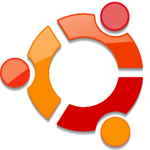
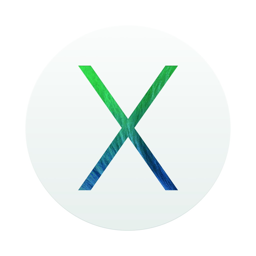

# Welcome to VMX Docs


The VMX Object Detection Engine comes with a highly-optimized visual
object detection algorithm engineered for speed, accuracy, and
ease-of-use.  VMX lets you quickly train new object models as well use
those models as object detectors for recognizing/localizing/tracking
objects in images and videos. The VMX Engine runs as a server and uses
a simple JSON-based command API so you can build apps in your favorite
programming language as well as interact with VMX over the HTTP
protocol.  For those of you that like cats, awks, and pipes, VMX can
also take commands from standard input (*command line support is
built-in*).  VMX is developed and maintained by vision. ai, LLC.

VMX runs on your personal computer, with native installers for Mac OS
X and Linux, as well as a Docker support which supports Windows, Mac
OS X, and Linux.  The VMX package consists of VMX Server, VMX Middle,
and the VMX App Builder.

This readme will first focus on installation/activation, then describe
the available VMX server API commands, and conclude with an overview
how VMX models are organized on your hard drive.

## Installing VMX

To install VMX, you need to download an installer from for either Mac
OS X or Linux. VMX requires v8.3 of the Matlab Compiler Runtime
(R2014a) installed on your machine.  The latest VMX releases and the
required MCR can be found below.

OS | Installer | MATLAB MCR
---|:----: | ---
Linux | <br/><a href="http://files.vision.ai/vmx/Linux/VMX.tar.gz">VMX.tar.gz</a> |  <br/><a href="http://www.mathworks.com/supportfiles/downloads/R2014a/deployment_files/R2014a/installers/glnxa64/MCR_R2014a_glnxa64_installer.zip">MCR_linux.zip</a>
Mac OS X | <br/><a href="http://files.vision.ai/vmx/Mac/VMX.pkg">VMX.pkg</a> |  <br/><a href="http://www.mathworks.com/supportfiles/downloads/R2014a/deployment_files/R2014a/installers/maci64/MCR_R2014a_maci64_installer.zip">MCR_mac.zip</a>

If you need to download any of the individual VMX components, download
an older version, or want to try a bleeding-edge experimental build,
please visit `http://files.vision.ai/vmx/`.

The Mac OS X VMX bundle together with the MATLAB MCR contain all
required libraries you will need for your Mac.  For Linux, you can
either install all dependencies on your own (if installing VMX
directly inside a system such as Ubuntu), or use our the official
vision.ai Docker image.  If you choose to use install VMX on a Linux
machine without using Docker, please refer to our Dockerfile to see
the required packages and libraries.

VMX server will look for the MCR inside the following default
locations:

OS | Default MCR location
------- | ---------
Linux    | /usr/local/MATLAB/MATLAB_Compiler_Runtime/
Mac OS X | /Applications/MATLAB/MATLAB_Compiler_Runtime/

The MCR field of the VMX `config.json` configuration file (See
[Configuring VMX](#configuration)) points to the MCR directory and can
be set to anything you like if you choose to install the MCR in an
unorthodox location.

### Linux notes

For Linux, you are free to install VMX anywhere you would like.
Typical Linux install directories are `/vmx/build/` or `~/vmx/`. In
this scenario the location of the `VMX binary ` will be
`/vmx/build/VMX` and the location of the `VMX server binary` will be
`/vmx/build/VMXserver`.

### Mac OS X notes

For MacOSX, VMX is typically installed into either
`/Applications/VMX.app/` or `~/Applications/VMX.app/`. The location of
the `VMX binary ` will be `/Applications/VMX.app/Contents/MacOS/` and
the location of the `VMX server binary` will be
`/Applications/VMX.app/Contents/MacOS/VMXserer.app/Contents/MacOS/`.

To uninstall in Mac OS X, simply remove the /Applications/VMX.app folder into your Trash.  VMX stores all of its files within this directory, so be sure to back up your models if you're created any of your own.


### Docker notes

Docker is the easiest way to install VMX, as it bundles *all*
dependencies and install steps into one command:

```sh
docker pull visionai/vmx
```

You can install docker directly on your Linux machine using apt-get,
or on your Mac OS X / Windows computer via boot2docker.  You can find
information about Docker at [http://www.docker.com](http://www.docker.com) and information bout
boot2docker at [https://github.com/boot2docker/boot2docker](https://github.com/boot2docker/boot2docker).

You can also find a set of useful Docker command line scripts at the
following github repository:

[VISIONAI/vmx-docker-manager](https://github.com/VISIONAI/vmx-docker-manager)

## Activating VMX

To run VMX locally, each VMX installation requires a valid key, an
agreement of the End User Licensing Agreement, and an internet
connection to convert a key into a valid license from the vision.ai
activation server.  Activation is usually performed from within the
VMX App Builder program, but you can visit
[https://forums.vision.ai](https://forums.vision.ai) for more help if
you need to activate VMX a different way.

A valid key corresponding to an personal license can be purchased from
[https://vision.ai](https://vision.ai).  Please see
[https://forums.vision.ai](https://forums.vision.ai) to learn more about any specials offers and
finding out how to be a beta tester.

Once you've obtained a valid VMX key, you can perform the activation
procedure on the command line:

```sh
./activate.sh key email
```

This documentation can be found at
[docs.vision.ai](http://docs.vision.ai).

***Copyright 2013-2014 vision.ai, LLC. All rights reserved.***
